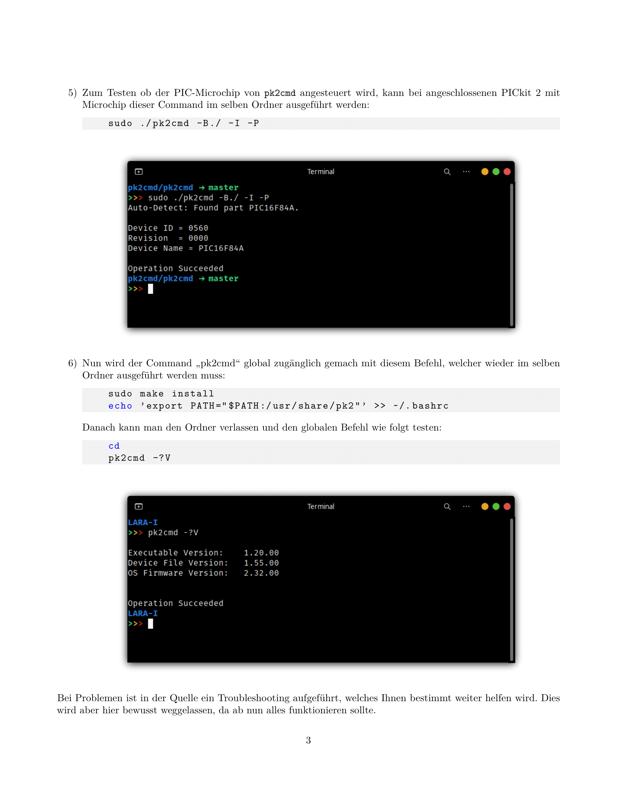

# PIC-Programmierung mit PICkit 2 unter Linux
#### Von Manuel Lippert für den Kurs \enquote{Prozessrechner und Elektronik} an der Universität Bayreuth

Dies ist eine Anleitung für das Aufsetzen von Assembler unter Linux mit der Zusätzlichen Erklärung, wie man es weiter in Visual Studio Code einrichten kann. Diese Anleitung entstand im Rahmen des Moduls "Prozessrechner und Elektronik" an der Universität Bayreuth und soll kommenden Studenten den Programmiereinstieg vereinfachen.

# Anleitung

